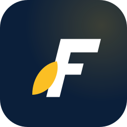

# FlyttGo brand mark

Live preview of every variant the FlyttGo logo ships in. GitHub
renders SVG via ``, so every preview below is the exact file
the app uses — same vector geometry, same colors. No bitmap
conversion; what you see is what deploys.

## Full lockup

### Color · light surface


### Inverse · navy surface


## Composition

| Variant | Preview |
|---|---|
| F-mark only (favicon / app-icon scale) |  |
| Wordmark only (footer / inline) |  |

## Live deployed assets

These are the actual files served at `/favicon.svg` and
`/apple-touch-icon.svg` — same geometry, sized for the browser tab
and iOS home-screen contexts respectively.

| File | Usage | Preview |
|---|---|---|
| `public/favicon.svg` | Browser tab + bookmark icon (16-64 px) |  |
| `public/apple-touch-icon.svg` | iOS home-screen tile (180×180) |  |

## Anatomy

The mark is built from two layers:

1. **Italic block F.** Drawn as a single closed path in upright
   coordinate space, then a parent `<g>` applies `skewX(-14°)` plus
   a compensating translate. Skewing the whole letter rather than
   hand-slanting each vertex keeps every edge — the crossbar's
   right edge, the stem's left edge, the middle bar's terminus —
   at the exact same angle. That uniformity is what makes the
   glyph read as "italic" rather than "off-kilter".

2. **Leaf / flame accent.** Three-segment cubic Bézier teardrop in
   brand amber, drawn *outside* the skew group so its curves stay
   symmetrical instead of stretching diagonally with the italic.
   Sits at the bottom-left of the mark with its tip aimed at the
   F's stem.

The wordmark uses the system bold-italic stack at weight 900 with
`letter-spacing: -1.5` so the lockup reads tight without bundling
a font file.

## Palette

| Token | Hex | Usage |
|---|---|---|
| Ink | `#0b1f3a` | F-mark (color variant), `Flytt` text, navy backgrounds |
| Brand amber | `#d97706` | Leaf accent (color variant), `Go` text |
| Highlight amber | `#fbbf24` | Leaf accent + `Go` text on inverse variants, app-icon glow |
| White | `#ffffff` | F-mark on inverse variants, wordmark on navy |

## Usage in code

```tsx
import { FlyttGoLogo } from '@/components/brand';

// Full lockup, default size (32px)
<FlyttGoLogo />

// Mark only, larger, on a navy hero
<FlyttGoLogo size={64} variant="inverse" showWordmark={false} />

// Wordmark only for a footer strip
<FlyttGoLogo size={20} variant="mono-dark" showMark={false} />

// Monochrome white on a dark surface
<FlyttGoLogo size={40} variant="mono-light" />
```

In-app showcase: visit `/brand` for live render at multiple sizes
+ variants + composition flags.

## File map

```
src/components/brand/
  FlyttGoLogo.tsx         ← React component (all variants in code)
  index.ts                ← barrel re-export
src/pages/
  BrandPage.tsx           ← /brand showcase route
public/
  favicon.svg             ← deployed browser-tab favicon
  apple-touch-icon.svg    ← deployed iOS home-screen tile
docs/brand/
  lockup-color.svg        ← preview (this file)
  lockup-inverse.svg      ← preview
  mark-only.svg           ← preview
  wordmark-only.svg       ← preview
```
